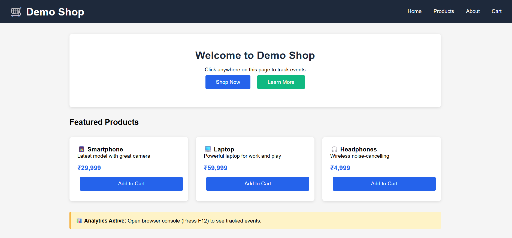
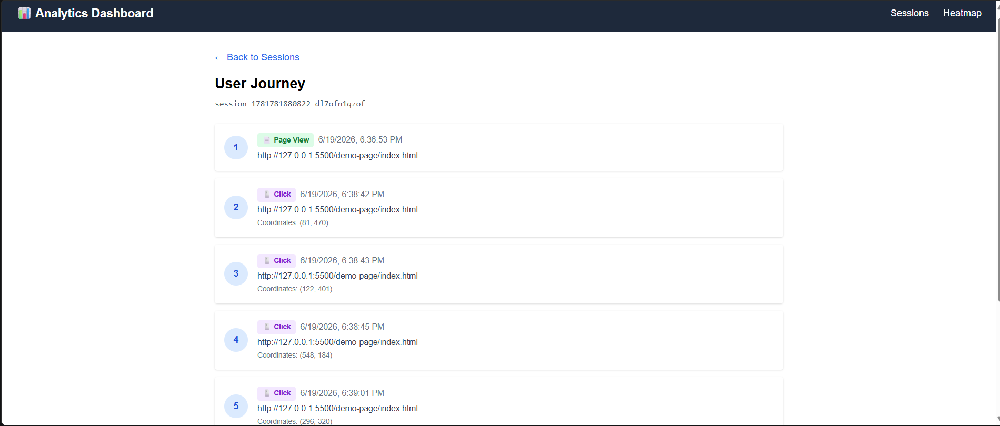
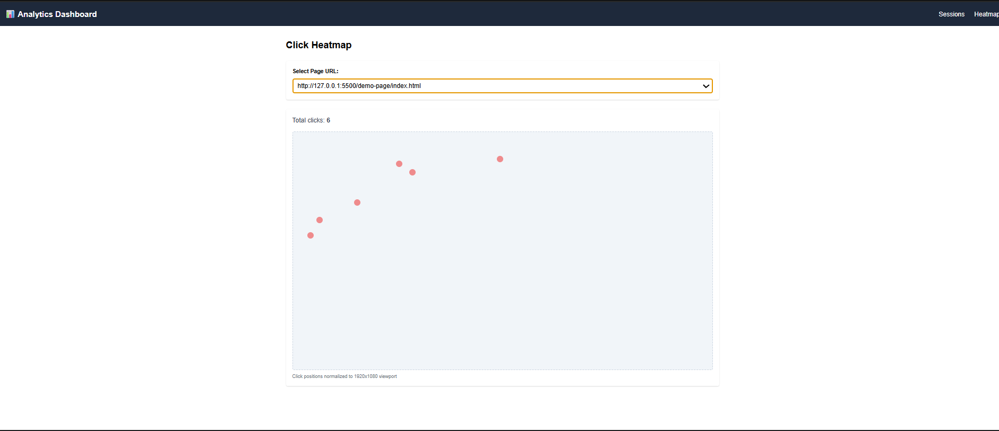

# Analytics Tracker

A full-stack user analytics application that tracks user interactions on a webpage and displays them in a dashboard. Built as part of the CausalFunnel Full Stack Engineer hiring assignment.

## 🚀 Live Demo

- **Dashboard:** https://analytics-tracker-frontend.vercel.app
- **Backend API:** https://analytics-tracker-backend.onrender.com

## Screenshots

### Demo Page (with tracker)

### Sessions Dashboard

### User Journey View

### Heatmap View

## Features

- **Event Tracking** — JavaScript script tracks page_view and click events with session IDs
- **Backend API** — Receives events, fetches sessions, user journeys, and heatmap data
- **MongoDB Storage** — All events stored with proper indexing
- **Dashboard** — Sessions list, user journey view, and click heatmap

## Tech Stack

**Frontend (Dashboard)**
- React (Vite)
- Tailwind CSS
- React Router
- Axios

**Backend**
- Node.js
- Express.js
- Mongoose

**Database**
- MongoDB Atlas

**Tracker (Client Side)**
- Vanilla JavaScript

## Project Structure

analytics-tracker/
- backend/        Node.js + Express API
- frontend/       React dashboard
- demo-page/      Sample HTML page with tracker

## Setup Steps

### Prerequisites
- Node.js installed
- MongoDB Atlas account (free tier works)
- VS Code with Live Server extension (for demo page)

### 1. Clone the repository

git clone https://github.com/Atharvpratapsingh/analytics-tracker.git
cd analytics-tracker

### 2. Backend Setup

cd backend
npm install

Create a .env file inside backend/ folder:

PORT=5000
MONGO_URI=your_mongodb_connection_string_here

Start the backend:

npm run dev

Backend runs on http://localhost:5000

### 3. Frontend Setup

Open a new terminal:

cd frontend
npm install
npm run dev

Frontend runs on http://localhost:5173

### 4. Demo Page Setup

Open demo-page/index.html with Live Server (VS Code extension), or directly in browser.

Click around the page to generate tracking events.

## API Endpoints

- POST /api/events                          Receive and store events
- GET  /api/sessions                        List all sessions with event counts
- GET  /api/sessions/:sessionId/events      Get all events for a session
- GET  /api/heatmap?pageUrl=...             Get click data for heatmap
- GET  /api/pages                           Get all unique page URLs

## Event Schema

- sessionId: String
- eventType: page_view or click
- pageUrl: String
- timestamp: Date
- clickX: Number (nullable)
- clickY: Number (nullable)

## Assumptions and Trade-offs

- Session ID stored in localStorage (simple and persistent across visits)
- No authentication — assignment did not require it
- Heatmap visualization uses dots normalized to 1920x1080 viewport (simple approach)
- MongoDB indexes added on sessionId and pageUrl for query performance
- CORS enabled for all origins in development

## Author

Atharv Pratap Singh

GitHub: https://github.com/Atharvpratapsingh

LinkedIn: https://www.linkedin.com/in/atharv-pratap-singh-6521632a5
